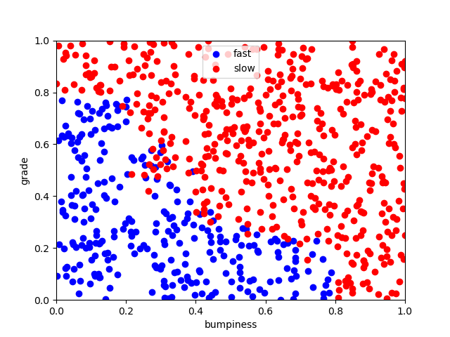
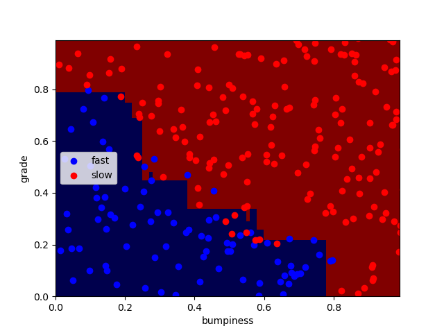
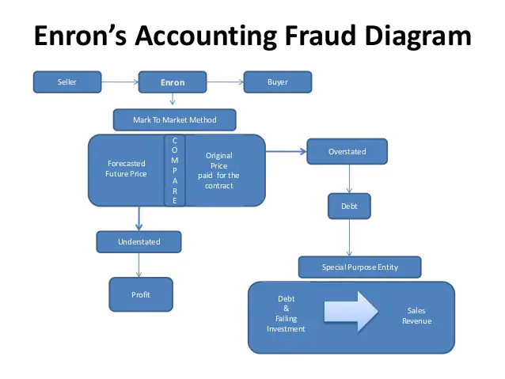

# MachineLearning101
This Repository Includes Mini Projects and a Final Project on Machine Learning.

## MiniP1_naives_bayes
A couple of years ago, J.K. Rowling (of Harry Potter fame) tried something interesting. She wrote a book, “The Cuckoo’s Calling,” under the name Robert Galbraith. The book received some good reviews, but no one paid much attention to it--until an anonymous tipster on Twitter said it was J.K. Rowling. The London Sunday Times enlisted two experts to compare the linguistic patterns of “Cuckoo” to Rowling’s “The Casual Vacancy,” as well as to books by several other authors. After the results of their analysis pointed strongly toward Rowling as the author, the Times directly asked the publisher if they were the same person, and the publisher confirmed. The book exploded in popularity overnight.
I have done something very similar in this project. I have a set of emails, half of which were written by one person and the other half by another person at the same company . My objective was to classify the emails as written by one person or the other based only on the text of the email. 
One particular feature of Naive Bayes is that it’s a good algorithm for working with text classification. When dealing with text, it’s very common to treat each unique word as a feature, and since the typical person’s vocabulary is many thousands of words, this makes for a large number of features. The relative simplicity of the algorithm and the independent features assumption of Naive Bayes make it a strong performer for classifying texts.

## MiniP2_support_vector_machine
In this mini-project, I have tackled the exact same email author ID problem as the Naive Bayes mini-project, but now with an SVM. What we find will help clarify some of the practical differences between the two algorithms. This project also gives us a chance to play around with parameters a lot more than Naive Bayes did, so we will do that too.

## MiniP3_decision_trees
In this mini-project, I have again tried to identify the authors in a body of emails, this time using a decision tree. The starter code can be found in decision_tree/dt_author_id.py.

## MiniP4_adaboost
A critical skill for any data analyst is the ability to figure out new things about machine learning. In this mini-project, I have again tried to identify the authors in a body of emails, this time using Adaboost (sometimes also called boosted decision tree) Algorithm. The goal is to do terrain classification with adaboost algorithm, researching and deploying it.
Scatter Plot             |  Decision Boundaries
:-------------------------:|:-------------------------:
  |  

## MiniP5_enron_dataset
Flowchart         
:-------------------------:

The Enron fraud is a big, messy and totally fascinating story about corporate malfeasance of nearly every imaginable type. The Enron email and financial datasets are also big, messy treasure troves of information, which become much more useful once you know your way around them a bit. I’ve tried combining the email and finance data into a single dataset, which we’ll explore in this mini-project.

## MiniP6_
In this mini-project
